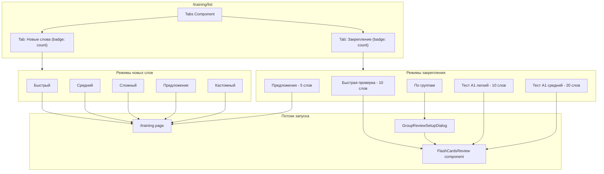

[//]: #'@ts-nocheck'

### План разработки: новые режимы тренировки/проверки

Обновлённая версия плана с учётом анализа существующей архитектуры и оптимизации этапов.

---

## ВАЖНО: Критические уточнения перед началом

### 1. Точное название группы A1

**Вопрос:** Какое точное название группы A1 в базе данных?

- Варианты: "A1: All words", "A1 Beginner", "A1", "A1: Базовые слова"
- **Действие:** Уточнить и добавить константу в `config/training-modes.ts`

### 2. Режим "Составление предложений" для изученных слов

**Проблема:** Существующий training flow загружает только `NOT_LEARNED` слова.

**Решение:**

- Параметризовать `useTrainingData`: добавить параметр `wordStatus: 'LEARNED' | 'NOT_LEARNED'`
- Сохранять тип источника слов в `sessionStorage` или через флаг в `STORAGE_KEYS`
- Передавать параметр из `startTrainingMode` в training flow

### 3. Счётчики в табах

**Вопрос:** Что показывать в badge табов?

- a) Количество доступных слов (изученных/неизученных) ← **рекомендуется**
- b) Количество доступных режимов (5/5)

---

## Архитектура решения



---

## Фаза 0: Подготовка (упрощённая)

**Статус:** Большая часть инфраструктуры уже существует

### ✅ Что уже готово:

- `/api/words/review` - универсальный endpoint для получения слов
- `FlashCardsReview` - компонент для быстрой проверки
- `GroupReviewSetupDialog` - диалог выбора группы
- `startTrainingMode` - хелпер запуска режимов
- Адаптер `BaseWord → Word` в `/api/words/review` (строки 250-300)

### 📋 Что нужно добавить:

1. **Компонент Tabs**

    ```bash
    npx shadcn-ui@latest add tabs
    ```

    - Проверить наличие `components/ui/tabs.tsx`

2. **Keyframes для анимаций** в `tailwind.config.ts`:
    ```typescript
    keyframes: {
        'fade-in': {
            '0%': { opacity: '0' },
            '100%': { opacity: '1' },
        },
        'slide-in-from-right': {
            '0%': { transform: 'translateX(10px)', opacity: '0' },
            '100%': { transform: 'translateX(0)', opacity: '1' },
        },
    },
    animation: {
        'fade-in': 'fade-in 0.2s ease-out',
        'slide-in': 'slide-in-from-right 0.2s ease-out',
    }
    ```

---

## Фаза 1: Типы и константы

### 1. Расширить `components/training-list/types/typing.ts`

```typescript
export type TrainingModeId =
    | 'quick'
    | 'medium'
    | 'hard'
    | 'sentences'
    | 'custom'
    // Новые режимы закрепления
    | 'learned-quick-check'
    | 'learned-group-check'
    | 'learned-sentences'
    | 'learned-test-a1-easy'
    | 'learned-test-a1-medium';

export type TrainingModeGroupId = 'new' | 'learned';

export type WordSource = 'notLearned' | 'learned' | 'group';
export type ModeType = 'training' | 'flashCards';

export type TrainingModeConfig = {
    id: TrainingModeId;
    title: string;
    shortDescription: string;
    detailedDescription: string;
    icon: LucideIcon;
    gradient: string;
    backgroundPattern?: string;
    enabledStages: number[];
    wordCount: number;
    settings: {
        stage1?: { showExamples: boolean };
        stage4?: { difficulty: 'easy' | 'medium' | 'hard' };
        stage5?: { sentencesPerWord: number };
    };

    // Новые поля
    wordSource: WordSource; // Источник слов
    modeType: ModeType; // Тип запуска
    groupId?: number; // ID группы для режимов с группами
    groupName?: string; // Название группы для UI
};
```

### 2. Добавить константу группы A1 в `config/training-modes.ts`

```typescript
// Константы для групп слов
export const A1_GROUP_ID = 4; // ID группы A1 в БД
export const A1_GROUP_NAME = 'A1: All words'; // TODO: уточнить точное название через SELECT name FROM "WordGroup" WHERE id = 4
```

### 3. Создать `components/training-list/constants/learned-training-modes.ts`

```typescript
import { BookCheck, ListChecks, FileText, GraduationCap } from 'lucide-react';
import { TrainingModeConfig } from '../types/typing';
import { A1_GROUP_ID, A1_GROUP_NAME } from '@/config/training-modes';

export const LEARNED_TRAINING_MODES: TrainingModeConfig[] = [
    {
        id: 'learned-quick-check',
        title: 'Быстрая проверка',
        shortDescription: '10 случайных изученных слов',
        detailedDescription:
            'Быстрая проверка 10 случайных изученных слов через карточки',
        icon: BookCheck,
        gradient: 'from-green-400 to-emerald-500',
        enabledStages: [],
        wordCount: 10,
        settings: {},
        wordSource: 'learned',
        modeType: 'flashCards',
    },
    {
        id: 'learned-group-check',
        title: 'Проверка по группам',
        shortDescription: 'Выберите группу для проверки',
        detailedDescription: 'Проверка слов из выбранной группы через карточки',
        icon: ListChecks,
        gradient: 'from-blue-400 to-cyan-500',
        enabledStages: [],
        wordCount: 20,
        settings: {},
        wordSource: 'group',
        modeType: 'flashCards',
    },
    {
        id: 'learned-sentences',
        title: 'Составление предложений',
        shortDescription: '5 слов, по 4 предложения на слово',
        detailedDescription:
            'Практика составления предложений с изученными словами',
        icon: FileText,
        gradient: 'from-purple-400 to-pink-500',
        enabledStages: [5],
        wordCount: 5,
        settings: {
            stage5: { sentencesPerWord: 4 },
        },
        wordSource: 'learned',
        modeType: 'training',
    },
    {
        id: 'learned-test-a1-easy',
        title: 'Тест A1 (лёгкий)',
        shortDescription: '10 случайных слов из A1',
        detailedDescription: `Проверка 10 случайных слов из группы "${A1_GROUP_NAME}"`,
        icon: GraduationCap,
        gradient: 'from-orange-400 to-red-500',
        enabledStages: [],
        wordCount: 10,
        settings: {},
        wordSource: 'group',
        modeType: 'flashCards',
        groupId: A1_GROUP_ID,
        groupName: A1_GROUP_NAME,
    },
    {
        id: 'learned-test-a1-medium',
        title: 'Тест A1 (средний)',
        shortDescription: '20 случайных слов из A1',
        detailedDescription: `Проверка 20 случайных слов из группы "${A1_GROUP_NAME}"`,
        icon: GraduationCap,
        gradient: 'from-red-400 to-rose-500',
        enabledStages: [],
        wordCount: 20,
        settings: {},
        wordSource: 'group',
        modeType: 'flashCards',
        groupId: A1_GROUP_ID,
        groupName: A1_GROUP_NAME,
    },
];
```

### 4. Обновить `components/training-list/constants/training-modes.ts`

Переименовать `TRAINING_MODES` → `NEW_WORDS_TRAINING_MODES` и добавить `wordSource` и `modeType`:

```typescript
export const NEW_WORDS_TRAINING_MODES: TrainingModeConfig[] = [
    {
        id: 'quick',
        // ... существующие поля
        wordSource: 'notLearned',
        modeType: 'training',
    },
    // ... остальные режимы
];
```

### 5. Создать `components/training-list/constants/training-modes-config.ts`

```typescript
import { NEW_WORDS_TRAINING_MODES } from './training-modes';
import { LEARNED_TRAINING_MODES } from './learned-training-modes';

export const TRAINING_MODE_GROUPS = {
    new: {
        id: 'new' as const,
        title: 'Новые слова',
        description: 'Тренировка неизученных слов',
        modes: NEW_WORDS_TRAINING_MODES,
    },
    learned: {
        id: 'learned' as const,
        title: 'Закрепление',
        description: 'Повторение изученных слов',
        modes: LEARNED_TRAINING_MODES,
    },
};
```

---

## Фаза 2: Хелперы и утилиты

### 1. Добавить константу в `config/storage-keys.ts`

```typescript
export const STORAGE_KEYS = {
    // ... существующие ключи
    TRAINING_WORD_SOURCE: 'training_word_source', // 'LEARNED' | 'NOT_LEARNED'
};
```

### 2. Обновить `components/training-list/helpers/startTrainingMode.ts`

Унифицировать запуск для всех типов режимов:

```typescript
export async function startTrainingMode(
    modeId: TrainingModeId,
    config: TrainingModeConfig,
    userId: string,
    currentLanguageId: number,
    allWords: Word[],
    router: any,
    setSelectedWords: (_words: Set<string>) => void,
    toast: (_options: any) => void,
    // Новые параметры для режимов закрепления
    onFlashCardsOpen?: (_params: FlashCardsReviewParams) => void,
    onGroupSetupOpen?: () => void,
): Promise<{ success: boolean; noWords?: boolean }> {
    // Режим custom → /training/setup
    if (modeId === 'custom') {
        router.push('/training/setup');
        return { success: true };
    }

    // Режим с FlashCards (quick-check, A1 тесты)
    if (config.modeType === 'flashCards') {
        if (modeId === 'learned-group-check') {
            // Открываем диалог выбора группы
            onGroupSetupOpen?.();
            return { success: true };
        }

        // Режимы с группой (A1 тесты)
        if (config.groupId) {
            // Проверяем доступность группы через API
            const isAvailable = await checkGroupAvailability(config.groupId);

            if (!isAvailable) {
                toast({
                    title: 'Группа недоступна',
                    description: `Группа "${config.groupName || 'A1'}" недоступна. Добавьте её в разделе "Группы слов".`,
                    variant: 'destructive',
                });
                return { success: false };
            }

            const params: FlashCardsReviewParams = {
                source: 'base',
                groupIds: [config.groupId],
                limit: config.wordCount,
                random: true,
                selectedGroupName: config.groupName,
            };

            onFlashCardsOpen?.(params);
            return { success: true };
        }

        // Быстрая проверка изученных
        const params: FlashCardsReviewParams = {
            status: 'LEARNED',
            limit: config.wordCount,
            random: true,
        };

        onFlashCardsOpen?.(params);
        return { success: true };
    }

    // Режим training (sentences для изученных или стандартные)
    const wordStatus =
        config.wordSource === 'learned' ? 'LEARNED' : 'NOT_LEARNED';

    // Фильтруем слова по статусу
    const filteredWords = allWords.filter(
        word =>
            Number(word.languageId) === currentLanguageId &&
            word.status === wordStatus,
    );

    const selectedWordsList = getLastAddedWords(
        filteredWords,
        currentLanguageId,
        config.wordCount,
    );

    if (selectedWordsList.length === 0) {
        return { success: false, noWords: true };
    }

    if (selectedWordsList.length < config.wordCount) {
        toast({
            title: 'Недостаточно слов',
            description: `Требуется ${config.wordCount} слов, доступно только ${selectedWordsList.length}. Тренировка будет запущена с доступными словами.`,
            variant: 'default',
        });
    }

    const wordIds = selectedWordsList.map(word => String(word.id));
    setSelectedWords(new Set(wordIds));

    saveEnabledStages(userId, config.enabledStages);

    if (config.settings.stage1) {
        saveStage1Settings(userId, config.settings.stage1);
    }
    if (config.settings.stage4) {
        saveStage4Settings(userId, config.settings.stage4);
    }
    if (config.settings.stage5) {
        saveStage5Settings(userId, config.settings.stage5);
    }

    // Сохраняем источник слов для training page
    sessionStorage.setItem(STORAGE_KEYS.TRAINING_WORD_SOURCE, wordStatus);
    sessionStorage.setItem(STORAGE_KEYS.TRAINING_FROM_SETUP, 'true');

    localStorage.removeItem(STORAGE_KEYS.TRAINING_PROGRESS);

    router.push('/training');

    return { success: true };
}

// Хелпер для проверки доступности группы
async function checkGroupAvailability(groupId: number): Promise<boolean> {
    try {
        const response = await fetch('/api/user/word-groups/all-accessible');
        if (!response.ok) return false;

        const groups = await response.json();
        const group = groups.find((g: any) => g.id === groupId);

        return !!group;
    } catch (error) {
        console.error('Error checking group availability:', error);
        return false;
    }
}
```

### 3. Обновить `prepareTrainingWords.ts`

Добавить функцию для изученных слов:

```typescript
/**
 * Получить последние добавленные слова (изученные или неизученные)
 */
export function getLastAddedWords(
    words: Word[],
    languageId: number,
    count: number,
    status?: 'LEARNED' | 'NOT_LEARNED',
): Word[] {
    return words
        .filter(word => {
            const matchesLanguage = Number(word.languageId) === languageId;
            const matchesStatus = status
                ? word.status === status
                : word.status !== 'LEARNED';
            return matchesLanguage && matchesStatus;
        })
        .sort((a, b) => {
            const dateA = new Date(a.createdAt).getTime();
            const dateB = new Date(b.createdAt).getTime();
            return dateB - dateA;
        })
        .slice(0, count);
}
```

---

## Фаза 3: Хуки и состояние

### 1. Обновить `hooks/training/use-training-data.ts`

Добавить поддержку загрузки изученных слов:

```typescript
export function useTrainingData(
    settingsLoaded: boolean,
    selectionLoaded: boolean,
    onWordsLoaded: (words: Word[]) => void,
    onLoadingChange: (loading: boolean) => void,
) {
    const { toast } = useToast();

    const fetchWords = useCallback(async () => {
        onLoadingChange(true);
        try {
            // Проверяем источник слов из sessionStorage
            const wordSource = sessionStorage.getItem(
                STORAGE_KEYS.TRAINING_WORD_SOURCE,
            );
            const status = wordSource === 'LEARNED' ? 'LEARNED' : 'NOT_LEARNED';

            const data = await trainingApi.fetchWords(status);
            onWordsLoaded(data);
        } catch (error) {
            console.error('Error fetching words:', error);
            toast({
                title: 'Ошибка',
                description: 'Не удалось загрузить слова',
                variant: 'destructive',
            });
        } finally {
            onLoadingChange(false);
        }
    }, [toast, onWordsLoaded, onLoadingChange]);

    useEffect(() => {
        if (settingsLoaded && selectionLoaded) {
            fetchWords();
        }
    }, [settingsLoaded, selectionLoaded, fetchWords]);

    return { fetchWords };
}
```

### 2. Обновить `components/training-list/hooks/useTrainingModes.ts`

Добавить состояния для табов и FlashCards:

```typescript
export function useTrainingModes() {
    // ... существующие состояния

    const [activeTab, setActiveTab] = useState<TrainingModeGroupId>('new');
    const [flashCardsParams, setFlashCardsParams] =
        useState<FlashCardsReviewParams | null>(null);
    const [showFlashCardsReview, setShowFlashCardsReview] = useState(false);
    const [showGroupReviewSetup, setShowGroupReviewSetup] = useState(false);

    // Мемоизация слов по статусу
    const { learnedWords, notLearnedWords } = useMemo(() => {
        const learned = allWords.filter(w => w.status === 'LEARNED');
        const notLearned = allWords.filter(w => w.status !== 'LEARNED');
        return { learnedWords: learned, notLearnedWords: notLearned };
    }, [allWords]);

    // Обработчик открытия FlashCards
    const handleFlashCardsOpen = (params: FlashCardsReviewParams) => {
        setFlashCardsParams(params);
        setShowFlashCardsReview(true);
    };

    // Обработчик открытия диалога выбора группы
    const handleGroupSetupOpen = () => {
        setShowGroupReviewSetup(true);
    };

    const handleStartMode = async (modeId: TrainingModeId) => {
        // ... существующая логика проверки session и settings

        const config = [
            ...NEW_WORDS_TRAINING_MODES,
            ...LEARNED_TRAINING_MODES,
        ].find(mode => mode.id === modeId);

        if (!config) return;

        setIsStarting(true);

        try {
            const result = await startTrainingMode(
                modeId,
                config,
                session.user.id,
                userSettings.learnLanguage.id,
                allWords,
                router,
                setSelectedWords,
                toast,
                handleFlashCardsOpen,
                handleGroupSetupOpen,
            );

            if (!result.success && result.noWords) {
                setShowNoWordsDialog(true);
                setIsStarting(false);
            }
        } catch (error) {
            // ... обработка ошибок
        }
    };

    return {
        // ... существующие возвращаемые значения
        activeTab,
        setActiveTab,
        learnedWords,
        notLearnedWords,
        flashCardsParams,
        showFlashCardsReview,
        setShowFlashCardsReview,
        showGroupReviewSetup,
        setShowGroupReviewSetup,
    };
}
```

### 3. Обновить `components/training-list/components/NoWordsDialog.tsx`

Добавить поддержку режима:

```typescript
interface NoWordsDialogProps {
    open: boolean;
    onOpenChange: (open: boolean) => void;
    mode?: 'new' | 'learned'; // Новый проп
}

export function NoWordsDialog({
    open,
    onOpenChange,
    mode = 'new',
}: NoWordsDialogProps) {
    const title =
        mode === 'learned' ? 'Нет изученных слов' : 'Нет слов для тренировки';
    const description =
        mode === 'learned'
            ? 'У вас пока нет изученных слов. Пройдите тренировку новых слов, чтобы пополнить список.'
            : 'У вас пока нет слов для тренировки. Добавьте слова на странице "Управление словами".';

    // ... остальная логика
}
```

---

## Фаза 4: UI — страница `/training/list`

### 1. Обновить `components/training-list/TrainingList.tsx`

```typescript
export function TrainingList() {
    const {
        activeTab,
        setActiveTab,
        learnedWords,
        notLearnedWords,
        startMode,
        isLoading,
        isStarting,
        showNoWordsDialog,
        setShowNoWordsDialog,
        showConfirmDialog,
        setShowConfirmDialog,
        handleContinueExisting,
        handleStartNew,
        isContinueLoading,
        flashCardsParams,
        showFlashCardsReview,
        setShowFlashCardsReview,
        showGroupReviewSetup,
        setShowGroupReviewSetup,
    } = useTrainingModes();

    if (isLoading) {
        return (
            <div className="flex items-center justify-center py-12">
                <Loader2 className="w-8 h-8 animate-spin text-purple-600" />
            </div>
        );
    }

    return (
        <div className="space-y-8">
            <div className="text-center">
                <h1 className="text-3xl font-bold text-gray-900 mb-3">
                    Режимы тренировок
                </h1>
                <p className="text-gray-600 max-w-2xl mx-auto">
                    Выберите подходящий режим тренировки или настройте свой собственный
                </p>
            </div>

            <Tabs value={activeTab} onValueChange={(v) => setActiveTab(v as TrainingModeGroupId)} className="w-full">
                <TabsList className="grid w-full grid-cols-2 max-w-md mx-auto mb-8">
                    <TabsTrigger value="new" className="relative">
                        Новые слова
                        <Badge variant="secondary" className="ml-2">
                            {notLearnedWords.length}
                        </Badge>
                    </TabsTrigger>
                    <TabsTrigger value="learned" className="relative">
                        Закрепление
                        <Badge variant="secondary" className="ml-2">
                            {learnedWords.length}
                        </Badge>
                    </TabsTrigger>
                </TabsList>

                <TabsContent value="new" className="animate-fade-in">
                    <div className="grid grid-cols-2 lg:grid-cols-5 gap-4 md:grid-cols-4">
                        {TRAINING_MODE_GROUPS.new.modes.map(mode => (
                            <div key={mode.id} className="md:max-w-[230px] lg:max-w-none">
                                <TrainingModeCard
                                    mode={mode}
                                    onClick={() => startMode(mode.id)}
                                    disabled={isStarting}
                                />
                            </div>
                        ))}
                    </div>
                </TabsContent>

                <TabsContent value="learned" className="animate-fade-in">
                    <div className="grid grid-cols-2 lg:grid-cols-5 gap-4 md:grid-cols-4">
                        {TRAINING_MODE_GROUPS.learned.modes.map(mode => (
                            <div key={mode.id} className="md:max-w-[230px] lg:max-w-none">
                                <TrainingModeCard
                                    mode={mode}
                                    onClick={() => startMode(mode.id)}
                                    disabled={isStarting || learnedWords.length === 0}
                                />
                            </div>
                        ))}
                    </div>
                    {learnedWords.length === 0 && (
                        <div className="text-center py-8 text-gray-500">
                            Нет изученных слов для закрепления
                        </div>
                    )}
                </TabsContent>
            </Tabs>

            {/* Диалоги */}
            <NoWordsDialog
                open={showNoWordsDialog}
                onOpenChange={setShowNoWordsDialog}
                mode={activeTab}
            />

            <NewTrainingConfirmationDialog
                open={showConfirmDialog}
                onOpenChange={setShowConfirmDialog}
                onContinue={handleContinueExisting}
                onStartNew={handleStartNew}
                continueLoading={isContinueLoading}
                startNewLoading={isStarting}
            />

            {/* FlashCards Review */}
            {showFlashCardsReview && flashCardsParams && (
                <FlashCardsReview
                    params={flashCardsParams}
                    onClose={() => {
                        setShowFlashCardsReview(false);
                        setFlashCardsParams(null);
                    }}
                />
            )}

            {/* Group Setup Dialog */}
            <GroupReviewSetupDialog
                open={showGroupReviewSetup}
                onOpenChange={setShowGroupReviewSetup}
                onStart={(params) => {
                    setFlashCardsParams(params);
                    setShowGroupReviewSetup(false);
                    setShowFlashCardsReview(true);
                }}
            />
        </div>
    );
}
```

---

## Фаза 5: Тестирование и edge cases

### Сценарии тестирования:

1. **Режим "Быстрая проверка"**
    - ✅ Есть 10+ изученных слов → запуск FlashCards
    - ⚠️ Меньше 10 изученных → показать все доступные
    - ❌ Нет изученных → показать NoWordsDialog

2. **Режим "По группам"**
    - ✅ Есть доступные группы → открыть диалог выбора
    - ❌ Нет групп → показать информацию

3. **Режим "Составление предложений"**
    - ✅ Есть 5+ изученных → запуск training со stage 5
    - ⚠️ Меньше 5 изученных → показать все доступные
    - ❌ Нет изученных → показать NoWordsDialog

4. **Тесты A1**
    - ✅ Группа найдена → запуск FlashCards с groupIds
    - ❌ Группа не найдена → toast с инструкцией

5. **Edge cases:**
    - Смена языка во время работы с табами
    - Параллельный запуск режимов
    - Незавершённая тренировка

---

## Фаза 6: Финализация

1. **Проверки качества**
    - `npm run type-check`
    - `npm run lint`
    - `npm run format`

2. **Regression testing**
    - Все существующие режимы работают без изменений
    - FlashCardsReview работает как раньше
    - Страница `/training` работает с новыми и старыми режимами

3. **Документация**
    - Обновить `README.md` (секция "Режимы тренировок")
    - Обновить `ARCHITECTURE.md` (новые компоненты и flow)

---

## Риски и митигация

| Риск                                  | Вероятность | Влияние | Митигация                                     |
| ------------------------------------- | ----------- | ------- | --------------------------------------------- |
| Группа A1 отсутствует                 | Высокая     | Среднее | Информативный toast с инструкцией             |
| Нет изученных слов                    | Высокая     | Низкое  | NoWordsDialog с объяснением                   |
| Конфликт hash-диалогов                | Низкая      | Среднее | Разные hash IDs для каждого диалога           |
| Regression в training flow            | Средняя     | Высокое | Тщательное тестирование + флаг источника слов |
| Проблемы с источником слов в training | Средняя     | Высокое | sessionStorage для передачи статуса           |

---

## Критерии готовности (Definition of Done)

- ✅ Табы на `/training/list` с анимацией и badge счётчиками
- ✅ Все 5 новых режимов запускаются корректно
- ✅ Edge cases обработаны (нет слов, нет группы A1)
- ✅ Режим sentences работает с изученными словами
- ✅ A1 тесты находят группу и запускаются
- ✅ FlashCardsReview/GroupSetup работают без конфликтов
- ✅ Нет typescript ошибок (`any` только где необходимо)
- ✅ Существующие режимы работают без регрессий
- ✅ Проверки типов/линта/формата проходят

---

## Детали режимов закрепления

### 1. Быстрая проверка изученных (`learned-quick-check`)

- **Слова:** 10 случайных изученных (`status=LEARNED`)
- **Запуск:** FlashCardsReview
- **API:** `/api/words/review?status=LEARNED&limit=10&random=true`

### 2. Проверка по группам (`learned-group-check`)

- **Слова:** Выбранная группа
- **Запуск:** GroupReviewSetupDialog → FlashCardsReview
- **API:** `/api/words/review?source=base&groupIds=X`

### 3. Составление предложений (`learned-sentences`)

- **Слова:** 5 случайных изученных
- **Запуск:** Training page с stage 5
- **Настройки:** `enabledStages=[5]`, `sentencesPerWord=4`
- **Важно:** Требует параметризации `useTrainingData`

### 4. Тест A1 (лёгкий) (`learned-test-a1-easy`)

- **Слова:** 10 из группы "A1: All words"
- **Запуск:** FlashCardsReview
- **API:** `/api/words/review?source=base&groupIds={A1_ID}&limit=10`

### 5. Тест A1 (средний) (`learned-test-a1-medium`)

- **Слова:** 20 из группы "A1: All words"
- **Запуск:** FlashCardsReview
- **API:** `/api/words/review?source=base&groupIds={A1_ID}&limit=20`

---

## Вопросы для финального уточнения

1. ✅ **Название группы A1:** Уточнить точное название в БД
2. ✅ **Счётчики:** Показывать количество слов или режимов?
3. ✅ **Режим Sentences:** Параметризация или отдельный компонент?
