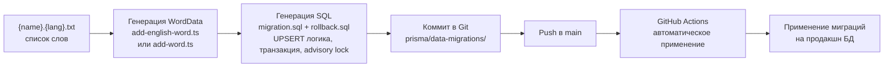

# Пайплайн генерации миграций данных для обновления продакшн БД

## Обзор

Создание пайплайна для генерации новых слов и переводов через **миграции данных** вместо прямого обновления БД. Миграции данных хранятся отдельно от схемных миграций и применяются транзакционно.
В v1 допускаются апдейты существующих переводов и примеров без хранения snapshot предыдущего состояния — принимается риск невозможности полного отката таких изменений.

## Архитектура пайплайна



## Структура директорий

```
prisma/
├── migrations/              # Схемные миграции (существующие)
│   └── 20251031191555_.../
│       └── migration.sql
└── data-migrations/         # Миграции данных (новые)
    └── 20260118120000_add_words_batch_1/
        ├── migration.sql    # SQL для применения (UPSERT)
        └── rollback.sql     # SQL для отката
```

**Отслеживание примененных миграций и метаданных:**

Для отслеживания примененных миграций данных создается таблица `DataMigration`:

```sql
CREATE TABLE IF NOT EXISTS "DataMigration" (
  "id" SERIAL PRIMARY KEY,
  "name" TEXT NOT NULL UNIQUE,
  "appliedAt" TIMESTAMP(3) NOT NULL DEFAULT CURRENT_TIMESTAMP,
  "appliedBy" TEXT,
  "gitSha" TEXT,
  "checksum" TEXT NOT NULL,
  "durationMs" INT,
  "status" TEXT NOT NULL DEFAULT 'SUCCESS'
);
```

Или использовать файл `prisma/data-migrations/.applied` для отслеживания примененных миграций.

## Формат входных файлов

**Имя файла:** `{name}.{lang}.txt`
- `name` - любое имя (например: `new_words`, `batch_1`, `spanish_verbs`)
- `lang` - код языка: `en` или `es`

**Примеры:**
- `new_words.en.txt` - английские слова
- `spanish_verbs.es.txt` - испанские глаголы
- `batch_1.en.txt` - первая партия английских слов

**Формат содержимого:**
```
hello
world
computer
```

Каждая строка - одно слово.

## Компоненты пайплайна

### 1. Главный пайплайн: `scripts/generate-word-migration-pipeline.ts`

**Назначение:** Оркестрация всего процесса генерации миграции

**Входные параметры:**
- Путь к файлу `{name}.{lang}.txt`
- Опционально: `--check-only` - только проверить какие слова новые, не генерировать миграцию

**Процесс:**
1. Парсинг имени файла для извлечения языка (`en` или `es`)
2. Чтение списка слов из файла
3. Для каждого слова:
   - Вызов соответствующего скрипта генерации (`add-english-word.ts` или `add-word.ts`)
   - Получение `WordData`
4. Генерация SQL миграции для всех слов (с UPSERT логикой - обновление существующих)
5. Генерация SQL rollback
6. Сохранение в `prisma/data-migrations/{timestamp}_{name}/`
7. Вывод инструкций для коммита и пуша в Git

**Использование:**
```bash
tsx scripts/generate-word-migration-pipeline.ts new_words.en.txt
tsx scripts/generate-word-migration-pipeline.ts spanish_verbs.es.txt --check-only
```

### 2. Генератор SQL миграций: `scripts/generate-word-migration.ts`

**Назначение:** Преобразование `WordData[]` в SQL миграцию

**Входные данные:**
- Массив `WordData` (все слова, включая существующие)
- Метаданные миграции (имя, описание)

**Выходные данные:**
- `migration.sql` - SQL для вставки/обновления данных (UPSERT)
- `rollback.sql` - SQL для отката (удаление/восстановление данных)

**Важно:** Миграция может обновлять существующие записи (UPSERT), а не только вставлять новые. Откат апдейтов в v1 не поддерживается (см. раздел Rollback).

**Структура SQL миграции (с UPSERT и сохранением существующих ID):**

```sql
-- Migration: add_words_batch_1
-- Generated: 2026-01-18 12:00:00
-- Words count: 10
-- Language: en
-- Strategy: UPSERT (insert or update existing, preserve existing IDs)

BEGIN;
SELECT pg_advisory_lock(hashtext('data_migrations_global_lock'));
SET LOCAL statement_timeout = '10min';
SET LOCAL lock_timeout = '60s';
SET LOCAL client_min_messages = warning;

-- Ensure languages exist (idempotent)
INSERT INTO "Language" ("code", "name") 
VALUES ('en', 'English'), ('ru', 'Russian'), ('es', 'Spanish')
ON CONFLICT ("code") DO NOTHING;

-- Ensure part of speech exists
INSERT INTO "PartOfSpeech" ("name") 
VALUES ('NOUN'), ('VERB')
ON CONFLICT ("name") DO NOTHING;

-- Ensure word sources exist (including migration label)
INSERT INTO "WordSource" ("code", "displayName") VALUES
  ('native', 'Native'),
  ('dm_20260118120000_add_words_batch_1', 'Data Migration add_words_batch_1')
ON CONFLICT ("code") DO NOTHING;

-- UPSERT BaseWord records
-- Новые слова получают sourceId = dm_...; существующие слова не меняют sourceId (чтобы rollback не удалил их)
INSERT INTO "BaseWord" ("word", "languageId", "sourceId") VALUES
  ('hello', (SELECT "id" FROM "Language" WHERE "code" = 'en'), (SELECT "id" FROM "WordSource" WHERE "code" = 'dm_20260118120000_add_words_batch_1')),
  ('world', (SELECT "id" FROM "Language" WHERE "code" = 'en'), (SELECT "id" FROM "WordSource" WHERE "code" = 'dm_20260118120000_add_words_batch_1'))
ON CONFLICT ("word", "languageId") 
DO NOTHING;

-- UPSERT WordTranslation records (используем подзапрос для получения baseWordId)
INSERT INTO "WordTranslation" ("baseWordId", "languageId", "translation", "priority", "partOfSpeechId") VALUES
  ((SELECT "id" FROM "BaseWord" WHERE "word" = 'hello' AND "languageId" = (SELECT "id" FROM "Language" WHERE "code" = 'en')),
   (SELECT "id" FROM "Language" WHERE "code" = 'ru'), 'привет', 1,
   (SELECT "id" FROM "PartOfSpeech" WHERE "name" = 'NOUN'))
ON CONFLICT ("baseWordId", "languageId", "priority") 
DO UPDATE SET 
  "translation" = EXCLUDED."translation",
  "partOfSpeechId" = EXCLUDED."partOfSpeechId";

-- Заменяем примеры: удаляем старые и вставляем новые.
-- Новые примеры помечаем sourceId = dm_... (для выборочного удаления при rollback)
DELETE FROM "WordExample" 
WHERE "baseWordId" IN (
  SELECT "id" FROM "BaseWord" 
  WHERE "word" IN ('hello', 'world', ...) 
  AND "languageId" = (SELECT "id" FROM "Language" WHERE "code" = 'en')
);

INSERT INTO "WordExample" ("baseWordId", "pronounId", "example", "translation", "translationLanguageId", "sentenceTypeId", "sourceId") VALUES
  -- ... примеры, указываем sourceId = (SELECT id FROM WordSource WHERE code = 'dm_20260118120000_add_words_batch_1')
ON CONFLICT DO NOTHING;

DELETE FROM "GrammaticalExample" 
WHERE "baseWordId" IN (
  SELECT "id" FROM "BaseWord" 
  WHERE "word" IN ('hello', 'world', ...) 
  AND "languageId" = (SELECT "id" FROM "Language" WHERE "code" = 'en')
);

INSERT INTO "GrammaticalExample" ("baseWordId", "tenseId", "pronounId", "example", "translation", "translationLanguageId", "sentenceTypeId", "sourceId") VALUES
  -- ... грамматические примеры, sourceId = (SELECT id FROM WordSource WHERE code = 'dm_20260118120000_add_words_batch_1')
ON CONFLICT DO NOTHING;

-- Запись о применении, времени, checksum и gitSha выполняется apply-скриптом параметрами после успешного выполнения

SELECT pg_advisory_unlock(hashtext('data_migrations_global_lock'));
COMMIT;
```

**Стратегия UPSERT с сохранением существующих ID и маркировкой вставок:**

- **BaseWord**: 
  - Если слово существует → запись не меняет `sourceId` (чтобы rollback не тронул существующую запись), **ID сохраняется**
  - Если слова нет → создается новая запись с `sourceId` = `dm_<timestamp>_<name>`
  - Подзапрос `(SELECT "id" FROM "BaseWord" WHERE "word" = '...' AND "languageId" = ...)` всегда возвращает правильный ID (существующий или новый)

- **WordTranslation**: 
  - Использует подзапрос для получения `baseWordId` (который может быть существующим или новым)
  - Обновляет `translation` и `partOfSpeechId` если запись существует
  - Создает новую запись если перевода еще нет

- **WordExample**: 
  - Использует подзапрос для получения `baseWordId`
  - Старые примеры удаляются, новые вставляются с `sourceId` = `dm_<timestamp>_<name>` (чтобы их можно было безопасно удалить при rollback)

- **GrammaticalExample**: 
  - Аналогично `WordExample`: удаляем старые, вставляем новые с маркировкой `sourceId` = `dm_<timestamp>_<name>`

**Важно:** Подзапросы `(SELECT "id" FROM "BaseWord" WHERE ...)` работают корректно как для существующих, так и для новых записей, так как они выполняются после UPSERT операции.

**Структура rollback.sql (v1):**

```sql
-- Rollback: add_words_batch_1 (v1)
-- Generated: 2026-01-18 12:00:00

BEGIN;
SET LOCAL statement_timeout = '10min';
SET LOCAL lock_timeout = '60s';

-- Удаляем только записи, созданные этой миграцией (помечены source = dm_...)
-- Примеры
DELETE FROM "GrammaticalExample"
WHERE "sourceId" = (SELECT "id" FROM "WordSource" WHERE "code" = 'dm_20260118120000_add_words_batch_1');

DELETE FROM "WordExample"
WHERE "sourceId" = (SELECT "id" FROM "WordSource" WHERE "code" = 'dm_20260118120000_add_words_batch_1');

-- Переводы: явной маркировки нет в схеме, откат переводов не выполняется в v1

-- Новые BaseWord, созданные этой миграцией
DELETE FROM "BaseWord"
WHERE "sourceId" = (SELECT "id" FROM "WordSource" WHERE "code" = 'dm_20260118120000_add_words_batch_1');

COMMIT;
```

**Важные моменты:**
- Все операции выполняются в одной транзакции с advisory lock.
- Использовать `ON CONFLICT` для идемпотентности.
- Для новых записей проставлять `sourceId` = `dm_<timestamp>_<name>` (BaseWord, WordExample, GrammaticalExample). В апдейтах `sourceId` не менять.
- Rollback v1 удаляет только новые записи, помеченные `dm_<...>`. Апдейты существующих переводов/примеров не откатываются.

### 3. Применение миграций данных: `scripts/apply-data-migrations.ts`

**Назначение:** Применить все непримененные миграции данных на продакшн БД

**Процесс:**
1. Подключение к БД через `DATABASE_URL`
2. Проверка таблицы `DataMigration` для определения примененных миграций
3. Поиск всех миграций в `prisma/data-migrations/`
4. Фильтрация: только непримененные миграции (отсортированные по имени)
5. Применение каждой миграции последовательно
6. Запись в таблицу `DataMigration` после успешного применения
7. Логирование всех операций

**Использование:**
```bash
tsx scripts/apply-data-migrations.ts
```

**Обработка ошибок:**
- Если миграция не может быть применена - остановка процесса, транзакция откатывается автоматически.
- Логирование ошибки с указанием миграции, времени и чексуммы.
- Возможность ручного отката через rollback.sql (только новые вставки, см. ограничения v1).

### 4. Скрипт применения в GitHub Actions: `scripts/apply-data-migrations.sh`

**Назначение:** Обертка для применения миграций данных в GitHub Actions

**Процесс:**
1. Проверка наличия `DATABASE_URL`
2. Создание бэкапа продакшн БД (через скрипт на сервере)
3. Запуск `scripts/apply-data-migrations.ts`
4. Проверка успешности применения
5. Логирование результатов

**Использование в GitHub Actions:**
```bash
./scripts/apply-data-migrations.sh
```

**Интеграция в deploy.yml:**
Добавляется как отдельный шаг после применения схемных миграций.

## Workflow использования

### Шаг 1: Подготовка файла со словами

```bash
# Создать файл с английскими словами
echo -e "hello\nworld\ncomputer" > new_words.en.txt

# Или испанские слова
echo -e "hola\ncasa\nlibro" > spanish_words.es.txt
```

### Шаг 2: Генерация миграции

```bash
# Генерация миграции (проверяет БД и создает миграцию только для новых слов)
tsx scripts/generate-word-migration-pipeline.ts new_words.en.txt
```

**Вывод:**
```
📖 Reading words from: new_words.en.txt
🌐 Detected language: en
📊 Found 3 words to process

🎯 Generating word data...
  ✅ hello - generated
  ✅ world - generated  
  ✅ computer - generated

🔍 Checking existing words in database...
  ⚠️  hello - already exists (skipped)
  ✅ world - new word
  ✅ computer - new word

📝 Generating migration for 2 new words...
✅ Migration created: prisma/data-migrations/20260118120000_new_words/
   - migration.sql (2 words)
   - rollback.sql
```

### Шаг 3: Ревью миграции

```bash
# Просмотр содержимого миграции
cat prisma/data-migrations/20260118120000_new_words/migration.sql

# Проверка rollback
cat prisma/data-migrations/20260118120000_new_words/rollback.sql
```

### Шаг 4: Коммит и пуш в Git

```bash
# Добавить миграцию в Git
git add prisma/data-migrations/20260118120000_new_words/

# Закоммитить
git commit -m "Add data migration: new_words (en)"

# Запушить в main
git push origin main
```

**После пуша в main:**
- GitHub Actions автоматически применит миграцию на продакшн
- Миграция будет применена после успешного деплоя приложения
- Результаты применения будут видны в логах GitHub Actions

### Шаг 5: Откат (если нужно)

**Ручной откат через SSH:**
```bash
# Подключиться к серверу
ssh root@164.92.130.190

# Применить rollback
cd /opt/flashcards
docker exec -i flashcards-db psql -U flashcards -d flashcards < prisma/data-migrations/20260118120000_new_words/rollback.sql

# Удалить запись о примененной миграции
docker exec flashcards-db psql -U flashcards -d flashcards -c "DELETE FROM \"DataMigration\" WHERE \"name\" = '20260118120000_new_words';"
```

## Интеграция с GitHub Actions

### Workflow применения миграций данных

Миграции данных применяются автоматически при пуше в `main` через GitHub Actions.

**Последовательность шагов в deploy.yml:**

1. **Build and push** - сборка и пуш Docker образа
2. **Deploy** - деплой на сервер:
   - Pull образа
   - **Применение схемных миграций** (`prisma migrate deploy`)
   - **Применение миграций данных** (`scripts/apply-data-migrations.sh`) ← новый шаг
   - Запуск приложения

**Добавление в deploy.yml:**

```yml
concurrency:
  group: data-migrations-${{ github.ref }}
  cancel-in-progress: false

- name: Apply data migrations
  uses: appleboy/ssh-action@v1.0.3
  env:
    DATABASE_URL: ${{ secrets.DATABASE_URL }}
    GIT_SHA: ${{ github.sha }}
  with:
    host: ${{ secrets.SERVER_HOST }}
    username: ${{ secrets.SERVER_USER }}
    key: ${{ secrets.SSH_PRIVATE_KEY }}
    script: |
      set -euo pipefail
      cd /opt/flashcards

      echo "Creating database backup..."
      ./scripts/server-setup/backup-db-prod.sh

      echo "Applying data migrations..."
      export DATABASE_URL="${DATABASE_URL}"
      export GIT_SHA="${GIT_SHA}"
      docker compose -f docker-compose.prod.yml run --rm --no-deps app \
        tsx scripts/apply-data-migrations.ts

      echo "Data migrations applied successfully"
```

**Альтернативный вариант (через скрипт на сервере):**

```yml
- name: Apply data migrations
  uses: appleboy/ssh-action@v1.0.3
  with:
    host: ${{ secrets.SERVER_HOST }}
    username: ${{ secrets.SERVER_USER }}
    key: ${{ secrets.SSH_PRIVATE_KEY }}
    script: |
      cd /opt/flashcards
      ./scripts/apply-data-migrations.sh
```

**Переменные окружения:**
- `DATABASE_URL` должен быть доступен в GitHub Secrets
- Или передаваться через переменные окружения сервера

### Логирование и мониторинг

Все операции применения миграций логируются в GitHub Actions:
- Список примененных миграций
- Ошибки применения (если есть)
- Время выполнения
- Ссылка на коммит, который вызвал миграцию

## Технические детали

### Подключение к продакшн БД

В GitHub Actions используется прямое подключение через `DATABASE_URL` из переменных окружения сервера:

```bash
# DATABASE_URL устанавливается в GitHub Actions secrets
# Подключение происходит напрямую к контейнеру PostgreSQL на сервере
```

### Отслеживание примененных миграций

Для отслеживания примененных миграций данных используется таблица `DataMigration`:

```sql
CREATE TABLE IF NOT EXISTS "DataMigration" (
  "id" SERIAL PRIMARY KEY,
  "name" TEXT NOT NULL UNIQUE,
  "appliedAt" TIMESTAMP(3) NOT NULL DEFAULT CURRENT_TIMESTAMP,
  "appliedBy" TEXT,
  "gitSha" TEXT,
  "checksum" TEXT NOT NULL,
  "durationMs" INT,
  "status" TEXT NOT NULL DEFAULT 'SUCCESS'
);
```

**Создание таблицы:**
Таблица создается автоматически при первом применении миграций данных или через отдельную миграцию схемы.

**Проверка примененных миграций:**
```sql
SELECT "name", "appliedAt", "appliedBy", "commitSha" 
FROM "DataMigration" 
ORDER BY "appliedAt" DESC;
```

### Обработка зависимостей

При генерации SQL миграции необходимо учитывать зависимости:

1. **Language** - должен существовать (используется `ON CONFLICT DO NOTHING`)
2. **PartOfSpeech** - должен существовать
3. **WordSource** - должен существовать (обычно 'native')
4. **Pronoun** - создается если не существует
5. **Tense** - создается если не существует
6. **SentenceType** - создается если не существует

### Идемпотентность, UPSERT и маркировка вставок

Миграции должны быть идемпотентными и поддерживать обновление существующих записей **с сохранением их ID**:

- Использовать `ON CONFLICT ... DO UPDATE` для обновления существующих записей
- Использовать `ON CONFLICT DO NOTHING` только для справочных таблиц (Language, PartOfSpeech)
- **Сохранение существующих ID**: 
  - При UPSERT `BaseWord` существующий ID сохраняется автоматически (PostgreSQL не меняет ID при UPDATE)
  - Подзапросы `(SELECT "id" FROM "BaseWord" WHERE ...)` всегда возвращают правильный ID:
    - Если слово существует → возвращает существующий ID
    - Если слова нет → после INSERT возвращает новый ID
- **BaseWord**: Если слово уже существует, `sourceId` не меняется (чтобы rollback не затронул запись), **ID остается прежним**
- **WordTranslation**: Использует подзапрос для получения `baseWordId` (который может быть существующим), обновляет `translation` и `partOfSpeechId` если запись существует
- **WordExample/GrammaticalExample**: Используют подзапросы для получения `baseWordId`, старые записи удаляются, новые вставляются с `sourceId` = `dm_<timestamp>_<name>`
- Проверка через таблицу `DataMigration` предотвращает повторное применение
- Rollback v1 удаляет только новые записи по `sourceId`, апдейты не откатываются

**Пример работы с существующим ID:**

```sql
-- Слово "hello" уже существует в БД с ID = 42
-- После UPSERT:
INSERT INTO "BaseWord" ("word", "languageId", "sourceId") VALUES
  ('hello', ..., ...)
ON CONFLICT ("word", "languageId") DO UPDATE SET "sourceId" = EXCLUDED."sourceId";
-- ID остается 42, только sourceId обновляется

-- Подзапрос вернет существующий ID = 42:
(SELECT "id" FROM "BaseWord" WHERE "word" = 'hello' AND "languageId" = ...)
-- Результат: 42

-- Переводы будут связаны с правильным ID = 42:
INSERT INTO "WordTranslation" ("baseWordId", ...) VALUES
  (42, ...)  -- Используется существующий ID
```

### Обработка ошибок

- Если генерация WordData не удалась для слова - пропустить его с предупреждением
- Если миграция не может быть применена - показать ошибку и предложить rollback
- Сохранять логи всех операций

## Файлы для создания

1. **`scripts/generate-word-migration-pipeline.ts`** - главный пайплайн генерации миграций
2. **`scripts/generate-word-migration.ts`** - генератор SQL миграций (с UPSERT логикой)
3. **`scripts/apply-data-migrations.ts`** - применение миграций данных (TypeScript)
4. **`scripts/apply-data-migrations.sh`** - обертка для GitHub Actions
5. **`prisma/data-migrations/.gitkeep`** - создание директории (если нужно)
6. **`.github/workflows/deploy.yml`** - модификация для применения миграций данных
7. **`prisma/migrations/YYYYMMDDHHMMSS_create_data_migration_table/migration.sql`** - миграция схемы для таблицы DataMigration (c расширенными полями)

## Модификации существующих файлов

1. **`scripts/add-english-word/add-english-word.ts`** - добавить возможность экспорта WordData без импорта в БД (флаг `--export-only`)
2. **`scripts/add-word/add-word.ts`** - аналогично, добавить `--export-only`
3. **`.github/workflows/deploy.yml`** - добавить шаг применения миграций данных после схемных миграций:

```yaml
# После строки 77 (prisma migrate deploy)
- name: Apply data migrations
  run: |
    cd /opt/flashcards
    ./scripts/apply-data-migrations.sh
```

## Примеры использования

### Пример 1: Добавление английских слов

```bash
# 1. Подготовка
echo -e "hello\nworld\ncomputer\nphone" > tech_words.en.txt

# 2. Генерация миграции
tsx scripts/generate-word-migration-pipeline.ts tech_words.en.txt

# 3. Ревью миграции
cat prisma/data-migrations/20260118120000_tech_words/migration.sql

# 4. Коммит и пуш
git add prisma/data-migrations/20260118120000_tech_words/
git commit -m "Add data migration: tech_words (en)"
git push origin main

# 5. GitHub Actions автоматически применит миграцию на продакшн
```

### Пример 2: Добавление испанских слов

```bash
# 1. Подготовка
echo -e "hola\ncasa\nlibro\nperro" > basic_spanish.es.txt

# 2. Генерация миграции
tsx scripts/generate-word-migration-pipeline.ts basic_spanish.es.txt

# 3. Коммит и пуш
git add prisma/data-migrations/20260118120000_basic_spanish/
git commit -m "Add data migration: basic_spanish (es)"
git push origin main
```

### Пример 3: Обновление существующих слов

Если слово уже существует в БД, миграция обновит его переводы и примеры:

```bash
# Создать миграцию для слова "hello" которое уже есть в БД
echo "hello" > update_hello.en.txt
tsx scripts/generate-word-migration-pipeline.ts update_hello.en.txt

# Миграция будет содержать UPSERT логику:
# - Обновит переводы если они изменились
# - Заменит примеры на новые (старые будут удалены, откат невозможен в v1)
# - Обновит грамматические примеры (старые будут удалены, откат невозможен в v1)
```

## Безопасность

1. **Всегда создавать бэкап** перед применением миграции (обязательно; при неуспехе — прерывать job)
2. **Ревью миграции** перед коммитом (через Git PR)
3. **Тестирование на локальной БД** перед продакшн (можно применить миграцию локально для проверки)
4. **Наличие rollback** для быстрого отката
5. **Логирование** всех операций в GitHub Actions
6. **Отслеживание примененных миграций** через таблицу `DataMigration` предотвращает повторное применение
7. **Идемпотентность** - миграции можно применять несколько раз без побочных эффектов (за счет `ON CONFLICT`) 
8. **Ограничения отката v1** - откатываются только новые вставки по `sourceId`; апдейты не откатываются
9. **Таймауты и батчи** - `statement_timeout=10min`, `lock_timeout=60s`, разбивка вставок на батчи по 200–300 записей

## Почему нужна маркировка вставленных сущностей

Маркировка (через создание `WordSource` вида `dm_<timestamp>_<name>` и присвоение его новым `BaseWord`/`WordExample`/`GrammaticalExample`) позволяет:
- безопасно удалить ТОЛЬКО вставленные этой миграцией записи при rollback;
- упростить аудит и диагностику;
- избежать удаления ранее существовавших данных при откате.

В схеме нет `sourceId` у `WordTranslation`, поэтому новые переводы откатывать точечно невозможно — это ограничение v1.

## Dry‑run на копии продакшн‑данных (опционально)

Dry‑run нужен, чтобы ловить ошибки до продакшна: синтаксис SQL, уникальные/внешние ключи, оценка времени. Если прод‑дамп хранить нельзя:
- использовать staging‑базу;
- или синтетический датасет для базовой проверки.

## Преимущества подхода

1. ✅ **Версионирование** - все изменения в Git
2. ✅ **Обратимость** - можно откатить любую миграцию
3. ✅ **Ревью через PR** - можно проверить SQL перед мерджем в main
4. ✅ **Автоматизация** - применение через GitHub Actions без ручного вмешательства
5. ✅ **Безопасность** - автоматический бэкап перед применением
6. ✅ **Прозрачность** - видно что именно будет изменено в Git diff
7. ✅ **Обновление существующих данных** - UPSERT логика обновляет существующие записи
8. ✅ **Идемпотентность** - миграции можно применять повторно без проблем
9. ✅ **Отслеживание** - таблица `DataMigration` показывает историю примененных миграций
